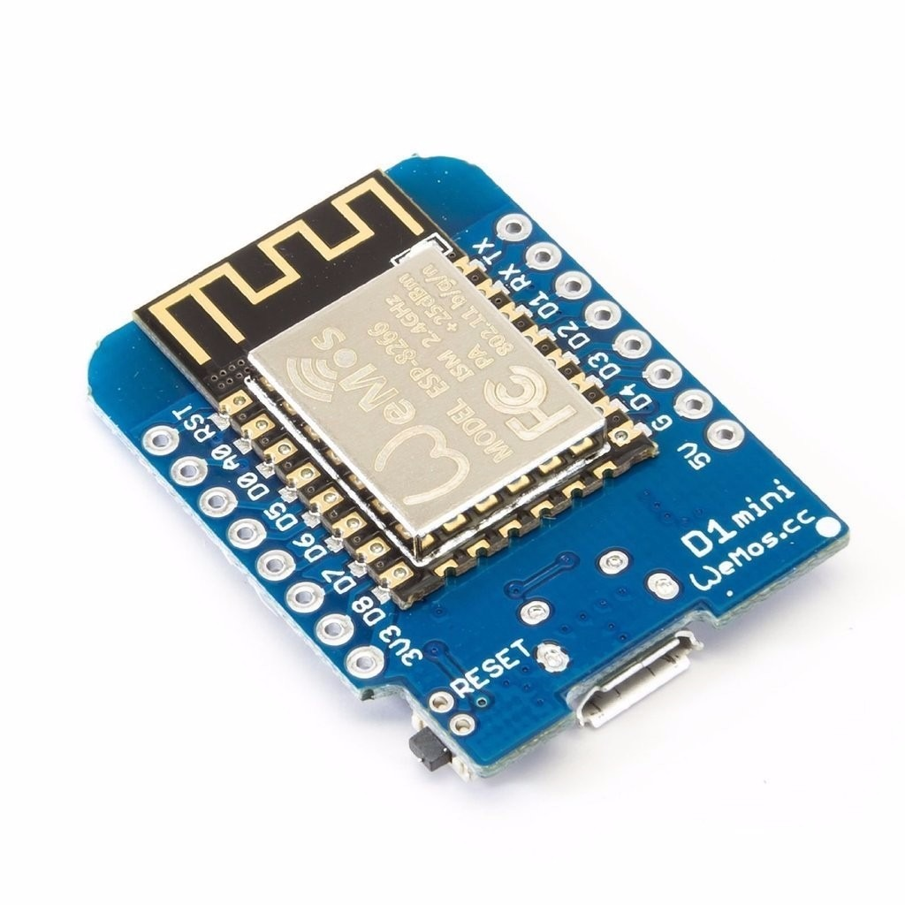
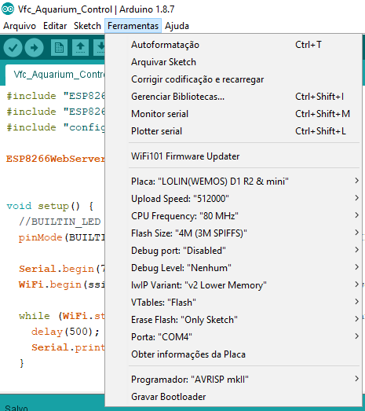

# Vfc AquaControl
# ESP8266 Wifi Aquarium Control

## To install ESP8266 in Arduino IDE
- see https://github.com/esp8266/Arduino

## ESP8266 Wemos D1 Mini


## Config sample of Arduino IDE with ESP8266 D1 Mini



# To see IP Address
```
- open arduino "Monitor Serial"
- reset ESP8266, and see information
```

## To upload files to ESP8266 SPIFFS (your web page):
```
- install esp8266fs from "https://github.com/esp8266/arduino-esp8266fs-plugin"
- copy dir or/and files to "/data" (for upload to ESP8266)
- run "ESP8266 Sketch Data Upload" from arduino tools menu
```

## To make web page
```
Copy all page files to "/data" and include "server.on" for each file, in "Vfc_Aquarium_Control.ino".
```

## To config Wifi connection
```
copy "config.example.h" to "config.h" and edit it
```

## Arduino Librarys
- MQTT Client
https://github.com/knolleary/pubsubclient

## To test MQTT
- Client for Android - MyMQTT
https://play.google.com/store/apps/details?id=at.tripwire.mqtt.client

## Important
```
Minify the files to reduce processing of ESP8266 (there are online services that do this).
```
